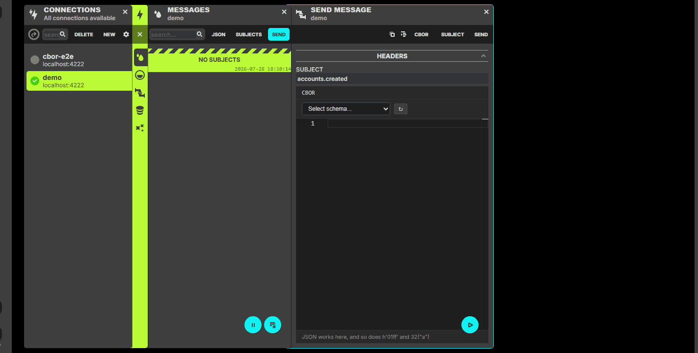
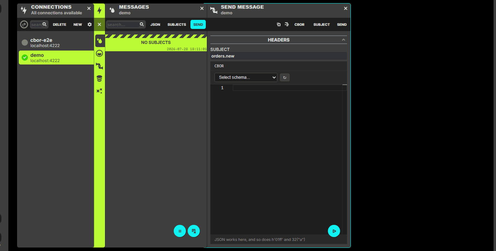

# CBOR + CDDL Messages

Read and write CBOR in NATS UI, optionally checked against your CDDL schemas.

## Setup

1. **Schemas directory**

   **Desktop App:**
   - **Windows**: `%LOCALAPPDATA%\nui-app\cddlschemas\default`
   - **Linux**: `~/.local/share/nui-app/cddlschemas/default`
   - **macOS**: `~/Library/Application Support/nui-app/cddlschemas/default`

   **Docker / server:** `/cddlschemas/default` (or `--cddl-schemas-path=...`)

2. **Add `.cddl` files** (UI demos: `person.cddl`, `order.cddl` in [`tests/cddlschemas/default`](tests/cddlschemas/default); `simple` / `simple2` are API test fixtures):

```
default/
├── person.cddl
└── order.cddl
```

3. **Simple example** (`person.cddl` — subjects like `accounts.>`):

```cddl
person = {
  name: tstr,
  age: uint,
  ? email: tstr,
}
```

## Usage

1. Pick **cbor** as the message format
2. Choose a schema; the **type** matching the file name is selected for you (`order.cddl` → `order`)
3. **Read:** the payload is decoded; a matching type is auto-detected when possible
4. **Send:** fill the fields (or switch to **Text** for diagnostic notation / JSON) and SEND

One type at a time is intentional. Helpers in the file (`uuid`, `line`) stay in the list if you need them, but opening the schema lands on the message type.

### Walkthroughs

| | |
|-|-|
| Simple send + decode |  |
| Nested order (bytes, arrays, optionals, integer keys) |  |

GIFs are under [`docs/images/`](docs/images/). Schemas used: `person.cddl`, `order.cddl`.

### Form behaviour

| Schema | UI |
|--------|-----|
| `? email: tstr` | **+ email** chip until added |
| `[+ line]` | one row, **+ line** for more |
| `"new" / "paid"` | dropdown |
| `bstr` / UUID | hex input |
| `{ * int => tstr }` | integer-keyed entries |
| bounds / `.regexp` | marked only when wrong (empty ≠ red) |

## Smart features

- Subject → schema/type cache. A remembered type is re-checked against each payload, so a schema that changes underneath is detected again instead of staying wrong
- Valid CBOR always decodes; CDDL only adds a match verdict
- Detection is bounded at 200 schemas per payload. Reaching the bound is reported in the **LOGS** card, never passed over in silence
- Server log: schema directory scan (`--log-level=debug` for each file). **LOGS** card: load count, detections, and anything that went undetected

## Testing

`make dev-web` loads the demo schemas from `tests/cddlschemas/default` (`person.cddl`, `order.cddl`). For your own files, point `--cddl-schemas-path` at your directory (or use the desktop app paths above).

```bash
cd frontend && npx vitest run src/utils/cbor src/utils/editor.test.ts src/components/formatters/cbor
go test ./internal/cddlschema/...
go test ./tests/ -run 'TestNuiTestSuite/TestCddlschemas'
```

Live round-trip (needs NATS + NUI): `NUI_E2E=1 npx vitest run src/utils/cbor/e2e.test.ts`

## Troubleshooting

- **No schemas** — check the directory above; server log shows `scanned cddl schemas found=N`
- **Wrong fields** — type is a helper (`uuid`); switch to the message type (`order` / `person`)
- **Not sent** — footer still waiting on a field, or Text mode is not valid CBOR
- **Mismatch on read** — payload decoded but does not match the selected type
- **Shown as plain CBOR** — the **LOGS** card says why: no schema matched, or more than 200 schemas are present and the rest were not tried. Pick the schema and type by hand

That's it. Drop `.cddl` files in the schemas directory and pick **cbor**.
